# @sensolus/snt-agent-kit

Locked shared code for Sensolus agent apps: `Snt*` widgets, theme CSS,
`SntColors`, i18n framework (`LocaleProvider`, `useLocale`, formatters), and
common translation strings.

Apps **import** from this package — they never copy widget source. ESLint in
the scaffolded app enforces no deep imports and no `Snt*` re-declarations.
Extend via slots/render props (`SntCard.titleButton`, `SntTable` column
`render`, `SntMap` children) or open a PR on this repo.

```jsx
import '@sensolus/snt-agent-kit/theme.css'
import {
  SntUiProvider, LocaleProvider,
  SntPageHeader, SntButton, SntCard, SntTable, /* ... */
} from '@sensolus/snt-agent-kit'
```

The live playground is `packages/widget-showcase` — run `npm run showcase` at
the monorepo root and open http://localhost:3100 for an interactive gallery
of every section below.

> **Reading this on npmjs.com?** Screenshots below will look broken — npmjs
> doesn't serve files from the package tarball and doesn't rewrite relative
> image paths. Browse the README on the repo (or in your editor) to see the
> images.

---

## Contents

1. [Setup](#setup)
2. [App-side contract](#app-side-contract) — `SntUiProvider`, `LocaleProvider`
3. [Page layout rules](#page-layout-rules)
4. [Widget catalog](#widget-catalog)
5. [Design tokens](#design-tokens) — colors, icons
6. [i18n framework](#i18n-framework)

---

## Setup

```bash
npm install @sensolus/snt-agent-kit
```

Peer deps: `react >=18`, `react-dom >=18`. `react-router-dom` is **not** a
peer dep — apps still use it themselves and pass `navigate` into
`SntUiProvider`.

In `main.jsx`:

```jsx
import '@sensolus/snt-agent-kit/theme.css'
import { SntUiProvider, LocaleProvider } from '@sensolus/snt-agent-kit'
import { useNavigate } from 'react-router-dom'
import { messages } from './i18n'   // app-owned translation keys

function Shell({ children }) {
  const navigate = useNavigate()
  return (
    <SntUiProvider navigate={navigate}>
      <LocaleProvider messages={messages}>{children}</LocaleProvider>
    </SntUiProvider>
  )
}
```

The kit defaults to a same-origin `/api/*` backend (matches the generated
app's Flask proxy). Override any endpoint by passing `api={{ ... }}` — see
[App-side contract](#app-side-contract).

---

## App-side contract

### `SntUiProvider`

Injects backend + navigation adapters used by kit widgets. Wrap your app
once at the root.

| Prop | Default | Purpose |
|---|---|---|
| `navigate` | `window.history.pushState / back` | Router integration — pass `useNavigate()` from react-router. `SntPageHeader` back button uses it. |
| `api.fetchLoginInfo` | `GET /api/loginInfo` | `LocaleProvider` reads user language / timezone / units. |
| `api.fetchGeozones` | `GET /api/geozones?orgId=…` | `SntMap` fetches geozones when `orgId` is set. |
| `api.geocode` | `GET /api/geocode?q=…` | `SntMap` search box. |
| `api.reverseGeocode` | `GET /api/reverse-geocode?lat=…&lng=…` | Reserved for future widgets. |

Only override what you need — omitted fields fall back to same-origin
defaults.

`useSntUi()` returns `{ api, navigate }` if a widget needs them directly.

### `LocaleProvider`

Fetches `/loginInfo` via `api.fetchLoginInfo` and exposes locale + formatting
context. Merge app-owned keys via the `messages` prop; app keys win on
collision.

```jsx
<LocaleProvider messages={{ en: { 'orgs.title': 'Organisations' }, nl: {...} }}>
  <App />
</LocaleProvider>
```

`useLocale()` returns:

```ts
{
  language: 'en' | 'nl' | 'fr' | 'de' | 'es',
  intlLocale: string,               // BCP-47 (e.g. 'nl-BE')
  timezone: string,                 // IANA (e.g. 'Europe/Brussels')
  firstDayOfWeek: 0 | 1,            // 0=Sun, 1=Mon
  unitDistance: 'km' | 'mi',
  unitTemperature: 'C' | 'F',
  t: (key, ...args) => string,      // interpolates function values
  loading: boolean,
}
```

Never hardcode locale — pass `intlLocale` + `timezone` from `useLocale()`
into formatters (`formatShortDate`, `formatDateTime`, `formatNumber`).

---

## Page layout rules

The theme carries these rules — follow them and pages compose without
one-off CSS.

1. **Page wrapper** — every page renders inside `.page-root` (24px top,
   16px sides, 16px bottom padding). Never add outer padding.
2. **Page header** — every page starts with `SntPageHeader`. Never
   hand-roll `<h1>` + back chevron.
3. **Summary stats live on the page**, not in a panel. Use
   `.summary-stats-row` directly under `.page-root`; never wrap in
   `SntCard`.
4. **Sections vs cards** — `SntSection` groups page regions (heading +
   body); `SntCard` is a content tile inside a region. Don't nest a
   section inside a card.
5. **Bar charts, not pies.** For part-to-whole comparisons render bars.
6. **Every chart axis has a label** (with units, e.g. "Distance (km)").
7. **Row cards match height** — cards in a row stretch to the tallest
   (default `align-items: stretch`). Don't fix per-card heights.
8. **Form fields are auto-width, min 100px.** Don't hardcode field width.
9. **Form labels are right-aligned** (label + field pattern).
10. **Filters sit in a white panel** — opposite of summary stats.
11. **Toolbars / date pickers go under a title**, stacked (toolbar first,
    date picker second). Not in the title row.
12. **Body text caps at 750px wide.** Full-width elements (tables, maps)
    are exempt.
13. **Vertical filter panels** span ≤ 2 of the 12 page columns.

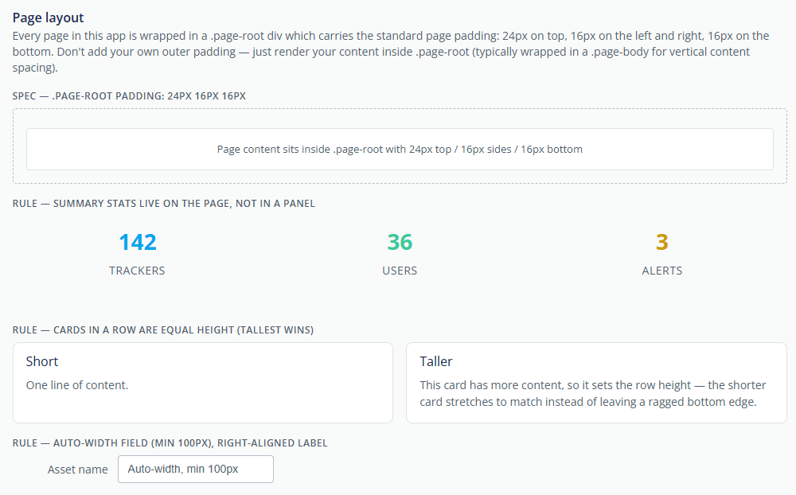

---

## Widget catalog

Each section below shows the widget's purpose, a screenshot, and the
minimal code to render it. For a live gallery of variants, run
`npm run showcase` at the monorepo root.

### `SntPageHeader`

Standard page-level header: title (`h1`), optional back button, right-aligned
actions slot. `backTo` routes through the `SntUiProvider` `navigate`
adapter, so it integrates with react-router. Use `onBack` for custom
navigation logic.

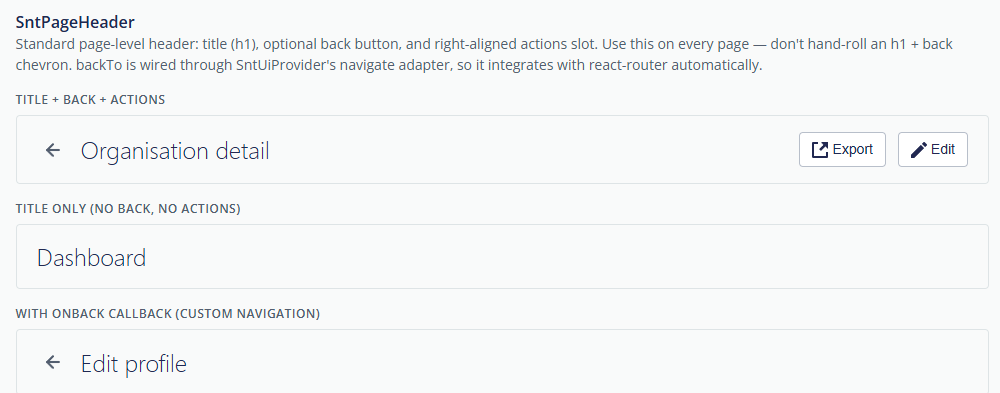

```jsx
<SntPageHeader
  title="Organisation detail"
  backTo="/organisations"
  actions={
    <>
      <SntButton icon={<SntIcon name="export" />}>Export</SntButton>
      <SntButton icon={<SntIcon name="edit" />}>Edit</SntButton>
    </>
  }
/>
```

### `SntButton`

The default (white) button is the everyday primary action — reach for it
almost always. Use `variant="emphasis"` (dark blue) sparingly for the
single most important action on a screen. `variant="delete"` is white with
a red border + red label and auto-adds a delete icon.

The first letter of the label is auto-capitalised.

**Variants:** `secondary` (default, white), `emphasis`, `success`, `danger`,
`warning`, `info`, `delete`. `primary` is a deprecated alias for `emphasis`.

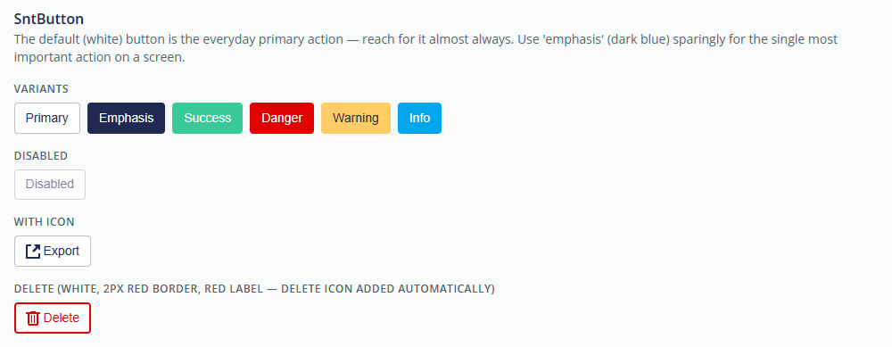

```jsx
<SntButton onClick={handleSave}>Save</SntButton>
<SntButton variant="emphasis" onClick={handleConfirm}>Confirm</SntButton>
<SntButton variant="delete" onClick={handleDelete}>Delete</SntButton>
<SntButton icon={<SntIcon name="export" />}>Export</SntButton>
```

**Button-order rules.** In forms: emphasis (blue) first, secondary (white)
second — Save before Cancel. In overlays/dialogs footer: emphasis first,
secondary second, `SntLink` third — Delete, Cancel, Learn more.

### `SntIcon`

Named SVG icons from the Sensolus set. Icons inherit surrounding text
color (`currentColor`) — they adapt to button variants, links, etc. Use
`SNT_ICON_NAMES` for the full list.

For any action button that matches an icon name (`export`, `download`,
`edit`, `settings`, `pdf`, `report`, …), put the icon in the button.

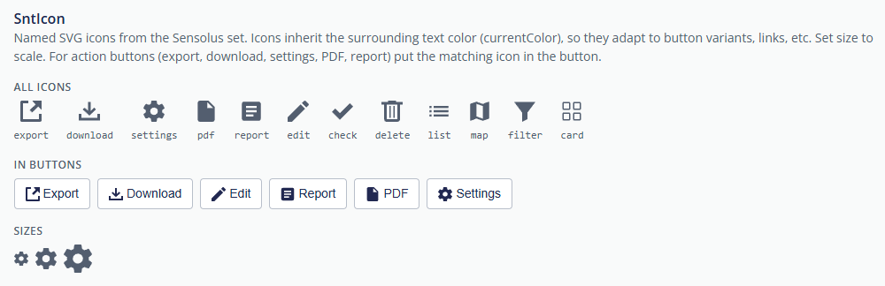

```jsx
<SntIcon name="settings" size={24} />
<SntButton icon={<SntIcon name="download" />}>Download</SntButton>
```

### `SntLink`

Brand-blue text link (underlines on hover). Renders `<a>` with `href`, or a
link-styled `<button>` with `onClick` — use the action form for tertiary
actions in a dialog footer (Learn more) or inline in body copy.

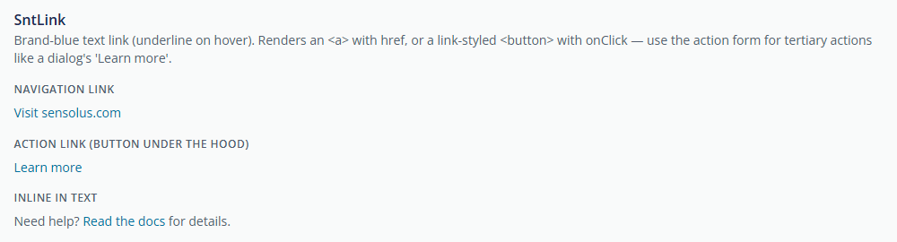

```jsx
<SntLink href="https://www.sensolus.com" target="_blank">Visit sensolus.com</SntLink>
<SntLink onClick={openDocs}>Learn more</SntLink>
```

### `SntBadge`

Compact status/label pill. Two flavours: **label** (plain, no dot) and
**status** (`dot`, leads with an 8px solid status dot). Use `dot` for
status indications.

**Variants:** `primary`, `secondary`, `success`, `warning`, `danger`,
`info`, `light`, `dark`, `orange`, `salmon`, `purple`, `emerald`.

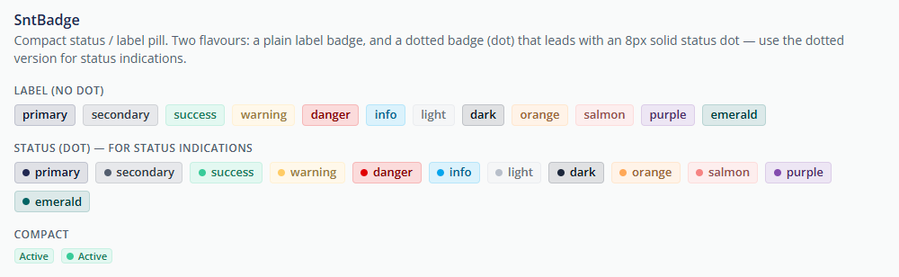

```jsx
<SntBadge variant="success" text="Active" />
<SntBadge variant="warning" text="Pending" dot />
<SntBadge variant="success" text="Active" compact dot />
```

### `SntMessage`

Inline contextual message block. Use for empty states, info notes,
validation summaries, success confirmations.

**Variants:** `info`, `success`, `warning`, `danger`. Omit for a neutral
grey block.

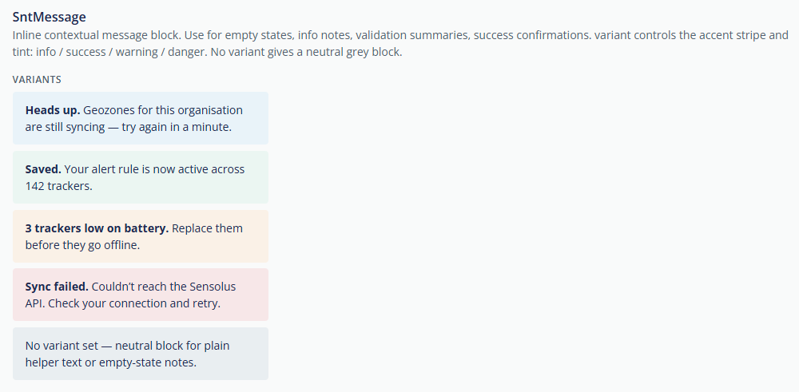

```jsx
<SntMessage variant="warning">
  <strong>3 trackers low on battery.</strong> Replace them before they go offline.
</SntMessage>
```

### `SntInput`

Text input. `onChange` receives the **value directly**, not an event.

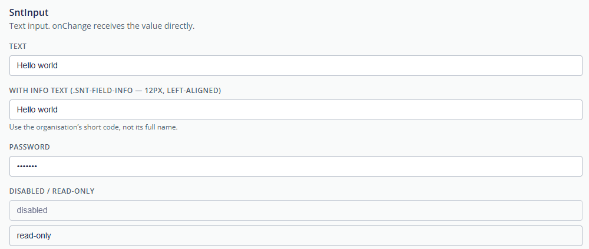

```jsx
<SntInput value={query} onChange={setQuery} placeholder="Search..." />
<SntInput type="password" value={pw} onChange={setPw} />
```

Pair with `.snt-field-info` for a 12px helper below the field:

```jsx
<SntInput value={code} onChange={setCode} placeholder="e.g. ACME-EU-01" />
<span className="snt-field-info">Use the organisation's short code, not its full name.</span>
```

### `SntSelect`

Native dropdown, Sensolus-styled. `options = [{ value, label }]`.
`onChange` receives the value directly.

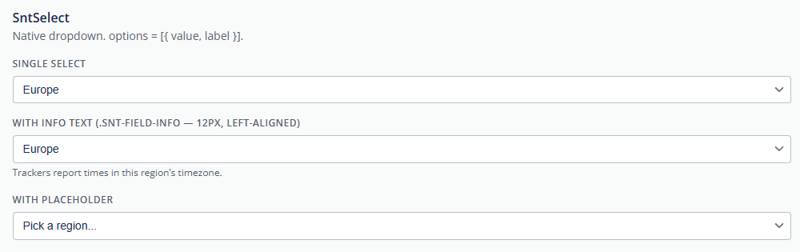

```jsx
<SntSelect
  value={region}
  onChange={setRegion}
  placeholder="Pick a region..."
  options={[
    { value: 'eu', label: 'Europe' },
    { value: 'us', label: 'United States' },
    { value: 'apac', label: 'Asia-Pacific' },
  ]}
/>
```

### `SntMultiSelect`

Dropdown that lets the user pick several options at once. Trigger looks
like `SntSelect`; clicking opens a checkbox popover with a select-all
toggle. `value` is an array; `onChange` always receives the full array of
selected values.

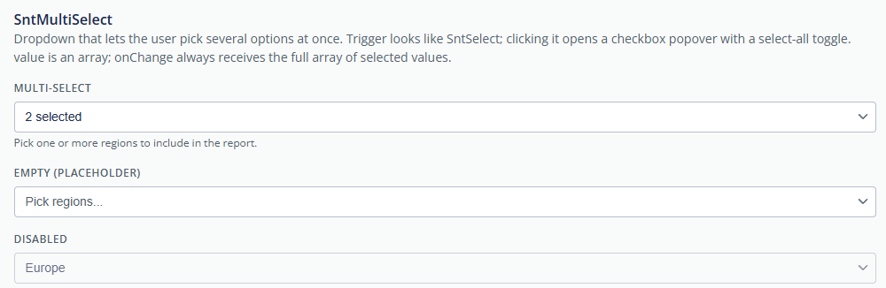

```jsx
<SntMultiSelect
  value={regions}
  onChange={setRegions}
  options={[
    { value: 'eu', label: 'Europe' },
    { value: 'us', label: 'United States' },
    { value: 'apac', label: 'Asia-Pacific' },
  ]}
/>
```

### `SntButtonGroup`

Segmented control for exclusive choices. Great for view toggles
(Cards / List / Map).

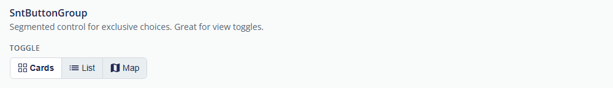

```jsx
<SntButtonGroup
  value={view}
  onChange={setView}
  options={[
    { value: 'cards', label: 'Cards', icon: <SntIcon name="card" /> },
    { value: 'list',  label: 'List',  icon: <SntIcon name="list" /> },
    { value: 'map',   label: 'Map',   icon: <SntIcon name="map" />  },
  ]}
/>
```

### `SntSwitch`

On/off toggle with optional label. `checked` is controlled.

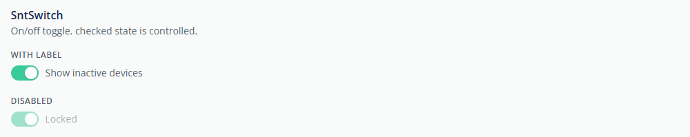

```jsx
<SntSwitch checked={activeOnly} onChange={setActiveOnly} label="Active only" />
```

### `SntCheckboxList`

Multi-select filter with a built-in select-all. `options` is a plain array
of strings. `layout='vertical'` (default) stacks options; `layout='horizontal'`
flows them inline.

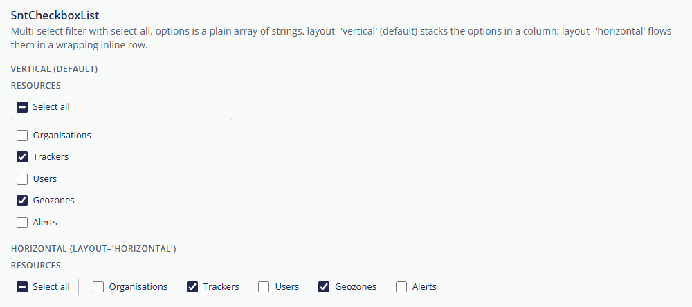

```jsx
<SntCheckboxList
  label="Resources"
  options={['Organisations', 'Trackers', 'Users', 'Geozones', 'Alerts']}
  selected={selected}
  onChange={setSelected}
/>
```

### `SntDateRangePicker`

Date range picker with `day / week / month / custom` modes, presets, and
locale-aware calendar. Value is `{ viewMode, start, end }` (Dates).

Since 0.7.1 modes and presets are merged into a **single `modes` prop** —
mix mode names and `DATE_RANGE_PRESETS` names (`last_7d`, `this_month`,
`last_12_months`, …) freely. Custom is always pushed to the end.

Use `getPresetRange(name)` to compute a range without mounting the picker,
`getDefaultDateRange(key)` for initial state.

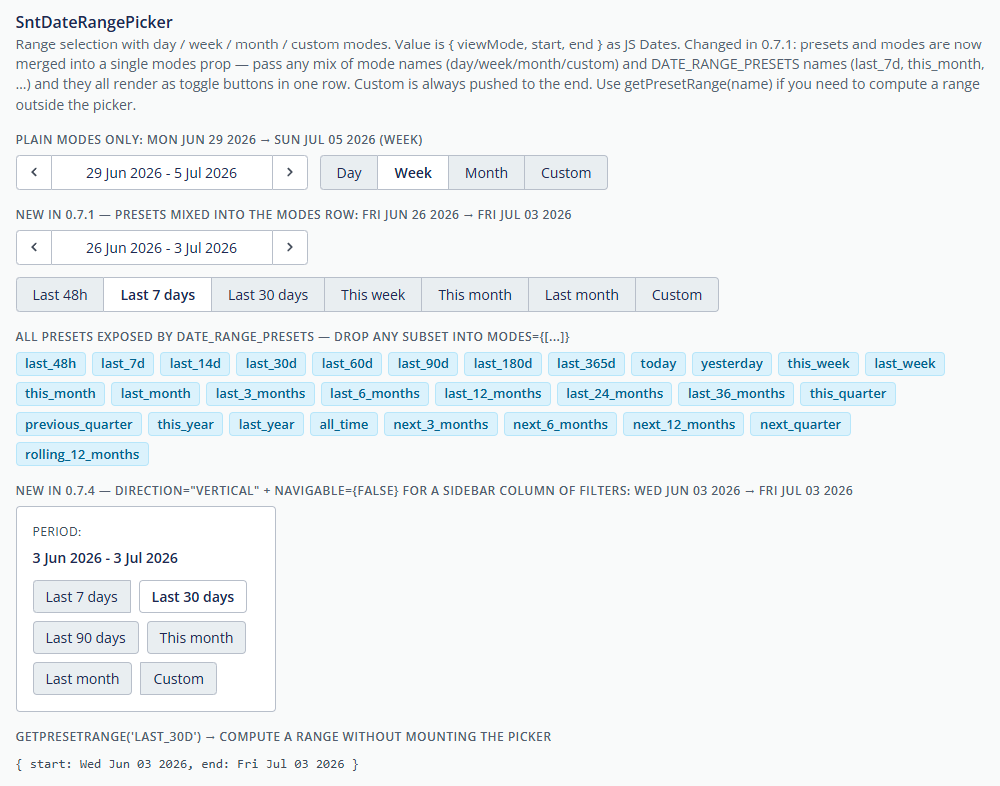

```jsx
const [range, setRange] = useState(() => getDefaultDateRange('week'))

<SntDateRangePicker
  value={range}
  onChange={setRange}
  modes={['last_48h', 'last_7d', 'last_30d', 'this_month', 'last_month', 'custom']}
/>
```

Vertical variant (0.7.4) for sidebar filters — `direction="vertical"` +
`navigable={false}`.

```jsx
<SntDateRangePicker
  value={range}
  onChange={setRange}
  direction="vertical"
  navigable={false}
  modes={['last_7d', 'last_30d', 'this_month', 'custom']}
/>
```

### `SntCard`

Surface for grouping content. Optional `title`, `badge`, `titleButton`,
`image`. `onClick` makes the whole card interactive.

Cards in a row stretch to the tallest card's height — don't set per-card
heights.

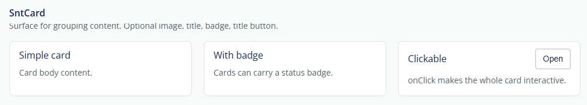

```jsx
<SntCard
  title="Fleet A"
  badge={{ text: 'NEW', variant: 'success' }}
  titleButton={<SntButton>Open</SntButton>}
  onClick={() => navigate('/fleet/a')}
>
  <p>142 trackers reporting</p>
</SntCard>
```

### `SntSection`

Titled page section — heading + optional description + body. Sits between
`SntPageHeader` (page-level) and `SntCard` (content tile).

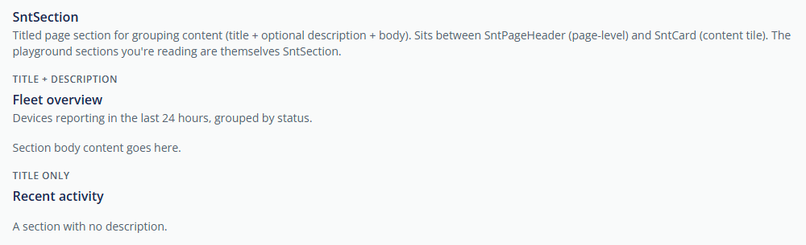

```jsx
<SntSection
  title="Fleet overview"
  description="Devices reporting in the last 24 hours, grouped by status."
>
  {/* content */}
</SntSection>
```

### `SntGrid` / `SntGridItem`

Responsive equal-height grid. Items wrap based on `minItemWidth`; `gap`
controls both axes.

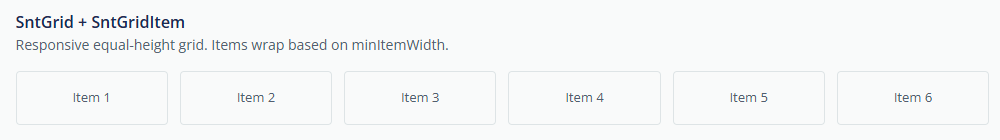

```jsx
<SntGrid minItemWidth={260} gap={12}>
  <SntGridItem><SntCard title="One">…</SntCard></SntGridItem>
  <SntGridItem><SntCard title="Two">…</SntCard></SntGridItem>
</SntGrid>
```

### `SntToolbar` / `SntToolbarSpacer`

Horizontal row for grouping actions. Drop `SntToolbarSpacer` between
groups to push the right group to the far edge.

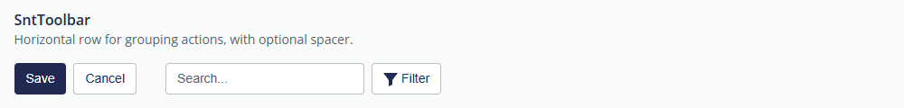

```jsx
<SntToolbar>
  <SntButton variant="emphasis">Save</SntButton>
  <SntButton>Cancel</SntButton>
  <SntToolbarSpacer />
  <SntInput value={search} onChange={setSearch} placeholder="Search..." />
  <SntButton icon={<SntIcon name="filter" />}>Filter</SntButton>
</SntToolbar>
```

### `SntTabs` / `SntTabPanel`

Standard horizontal tab strip. Controlled via `activeTab`.

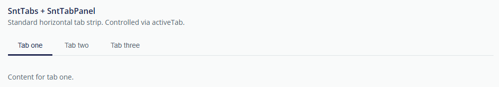

```jsx
const [tab, setTab] = useState('overview')

<SntTabs
  tabs={[{ key: 'overview', label: 'Overview' }, { key: 'devices', label: 'Devices' }]}
  activeTab={tab}
  onChange={setTab}
>
  <SntTabPanel tabKey="overview" activeTab={tab}>…</SntTabPanel>
  <SntTabPanel tabKey="devices"  activeTab={tab}>…</SntTabPanel>
</SntTabs>
```

### `SntTable`

Sortable, paginated data table. Columns define `key`, `header`, optional
`render`, `sortable`, `getValue`, `width`.

**`scroll` (0.6.0+):**
- `"none"` — flows with the page (no internal scroll). Use when the page
  already scrolls.
- `"internal"` — table body scrolls, sticky header + footer.
- `"viewport"` (+ `viewportOffset`) — pins table to viewport height minus
  the offset. Matches the pre-0.6 default (offset 120).

**`width` on columns (0.7.7+):** number → px, or any CSS string like
`'20%'` / `'8rem'`. Applies to both `<th>` and `<td>`.

Long values **wrap** (row grows) instead of truncating; unbreakable strings
(API keys, UUIDs) break at any character.

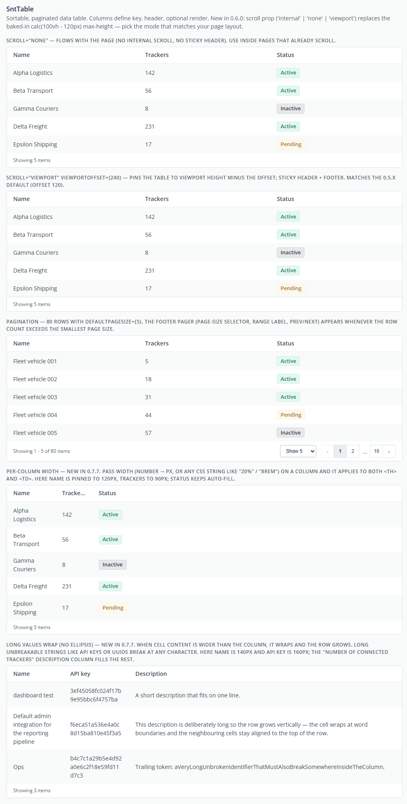

```jsx
<SntTable
  data={items}
  rowKey="id"
  defaultPageSize={25}
  pageSizeOptions={[25, 50, 100]}
  scroll="none"
  columns={[
    { key: 'name',     header: 'Name',     width: 140 },
    { key: 'trackers', header: 'Trackers', width: 90 },
    {
      key: 'status',
      header: 'Status',
      render: (row, val) => (
        <SntBadge variant={STATUS_VARIANT[val] || 'secondary'} text={val} />
      ),
    },
  ]}
/>
```

### `SntSummaryStat`

Big-number stat tile. `variant` colours the value; `hint` adds a small
sub-label. Pass `onClick` to make it a clickable filter — it gets a
pointer, hover lift, and keyboard focus; pair with `active` to mark the
selected one.

Non-clickable stats are flat white tiles (no border); clickable ones carry
a grey fill + border. Never wrap stats in an `SntCard`.

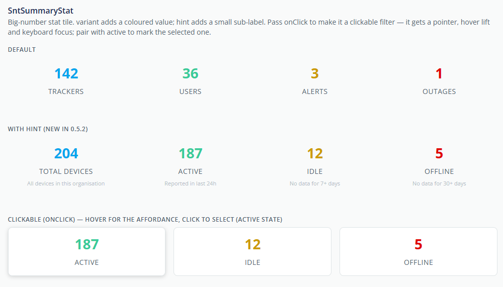

```jsx
<div className="summary-stats-row">
  <SntSummaryStat value="142" label="Trackers" variant="info" />
  <SntSummaryStat value="36"  label="Users"    variant="success" />
  <SntSummaryStat
    value="3"
    label="Alerts"
    variant="warning"
    hint="Last 24h"
    onClick={() => setFilter('alerts')}
    active={filter === 'alerts'}
  />
</div>
```

### `SntProgressBar`

Inline percentage bar. `variant="auto"` colours by value
(red/yellow/green thresholds).

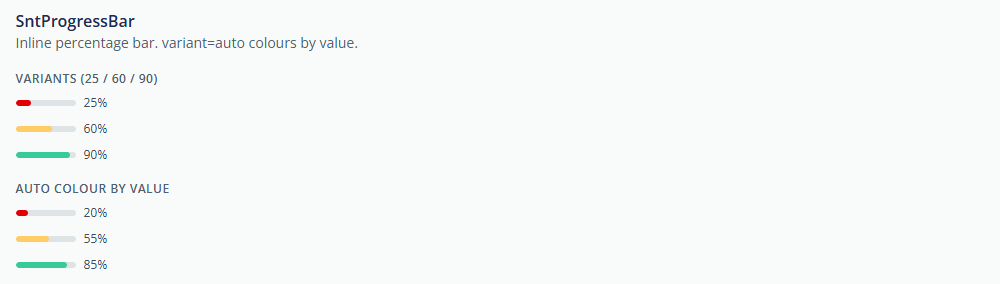

```jsx
<SntProgressBar value={75} variant="success" />
<SntProgressBar value={45} variant="auto" />
```

### `SntHistogram`

Microchart showing a distribution. Pass buckets as
`[{ start, end, count }, ...]`. Colours cycle from `SNT_HISTOGRAM_COLORS`.

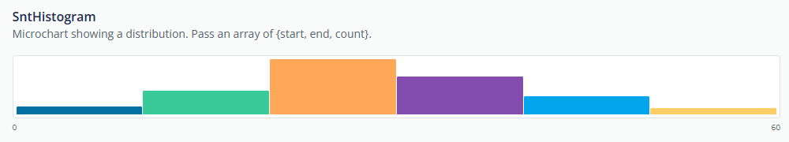

```jsx
<SntHistogram
  buckets={[
    { start: 0,  end: 10, count: 4  },
    { start: 10, end: 20, count: 12 },
    { start: 20, end: 30, count: 28 },
  ]}
  height={80}
/>
```

### `SntSpinner` / `SntLoadingOverlay`

Indeterminate loading indicators. `SntSpinner` sizes: `small`, `medium`,
`large`. `SntLoadingOverlay` renders a centred spinner + optional message
absolutely positioned inside a relatively-positioned parent.

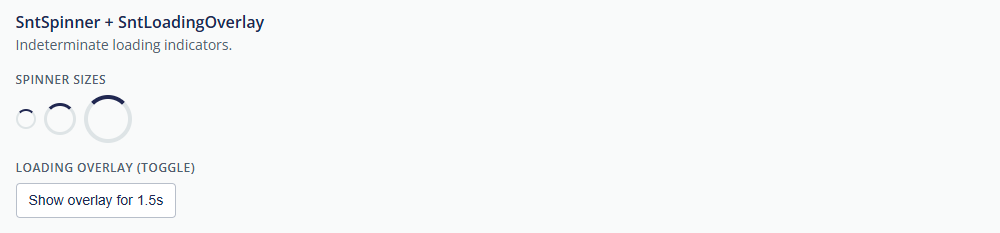

```jsx
<SntSpinner size="medium" />

<div style={{ position: 'relative', height: 120 }}>
  <SntLoadingOverlay message="Loading sample data..." />
</div>
```

### `SntDialog`

Modal dialog. `open` + `onClose` controlled by the caller.

**`footer` prop** — dedicated bordered button bar. Canonical order:
emphasis (blue) → secondary (white) → link (`SntLink`), left-aligned by
default (`footerAlign="start"`).

**Sizes:** `small` (400px), `medium` (600px), `large` (1100px).

**`fillHeight` + `scroll="none"`** with a child that scrolls internally
(e.g. `SntTable scroll="internal"`) gives you table-in-dialog UIs with
sticky header/pagination.

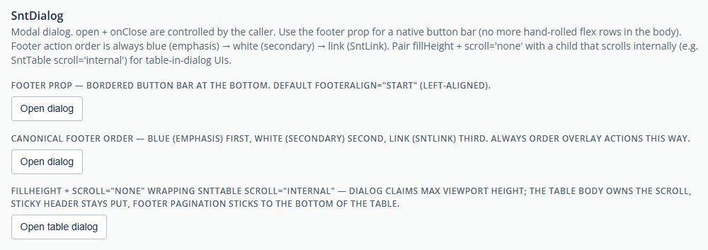

```jsx
<SntDialog
  open={open}
  onClose={() => setOpen(false)}
  title="Delete organisation"
  size="small"
  footer={
    <>
      <SntButton variant="delete" onClick={handleDelete}>Delete</SntButton>
      <SntButton onClick={() => setOpen(false)}>Cancel</SntButton>
      <SntLink onClick={openDocs}>Learn more</SntLink>
    </>
  }
>
  <p>Are you sure? This cannot be undone.</p>
</SntDialog>
```

### `SntSidepanel` / `SntFilterSection`

Collapsible filter rail used alongside list views. Sits in a **white
panel** — the framing that sets filters apart from summary stats.

Vertical filter panels span **≤ 2 of the 12 page columns** (rule 13).

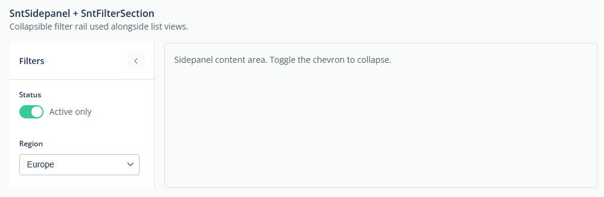

```jsx
<SntSidepanel
  title="Filters"
  open={open}
  onToggle={() => setOpen(v => !v)}
  width={240}
>
  <SntFilterSection label="Status">
    <SntSwitch checked={active} onChange={setActive} label="Active only" />
  </SntFilterSection>
  <SntFilterSection label="Date range">
    <SntDateRangePicker
      value={range}
      onChange={setRange}
      direction="vertical"
      navigable={false}
      modes={['last_7d', 'last_30d', 'this_month', 'custom']}
    />
  </SntFilterSection>
</SntSidepanel>
```

### `SntMap` (+ layers)

Leaflet base map with Street/Satellite toggle, geocoder search, and
top-right controls (zoom, current location, zoom-to-all). Compose by
nesting layer children — `SntDeviceLayer`, `SntGeozoneLayer`,
`SntMarkerClusterLayer`, or your own via `useSntMap()`.

**Tile-provider keys are required props** — the kit ships no keys. In a
generated app they come from `/api/config` at runtime so one image
deploys across environments.

**Layer chip control** (bottom-left) — every layer registers itself via
`useLayerToggle({ id, label, icon?, defaultVisible? })` and returns
current visibility. Built-in layers use the same hook you'd use for a
custom layer.

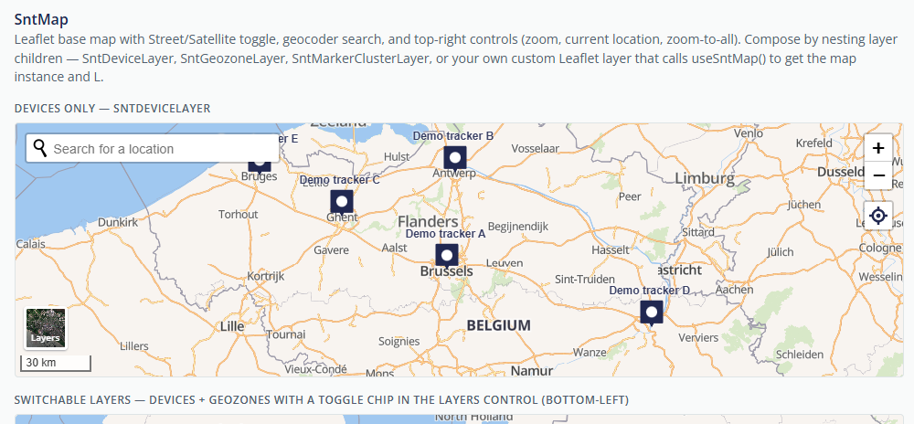

```jsx
const config = useAppConfig()  // {mapboxKey, locationiqKey} from /api/config

<SntMap
  mapboxKey={config.mapboxKey}
  locationiqKey={config.locationiqKey}
  height="480px"
  center={[50.85, 4.35]}
  zoom={6}
  orgId={orgId}       // triggers api.fetchGeozones(orgId)
  showCurrentLocation
  onZoomToAll={(map) => map.fitBounds(devices.map(d => [d.lastLat, d.lastLng]))}
>
  <SntGeozoneLayer geozones={geozones} />
  <SntDeviceLayer devices={devices} />
</SntMap>
```

**Custom layer** — call `useSntMap()` for the Leaflet map + bundled `L`,
`useLayerToggle()` to register a chip in the Layers control. No local
state or second effect needed.

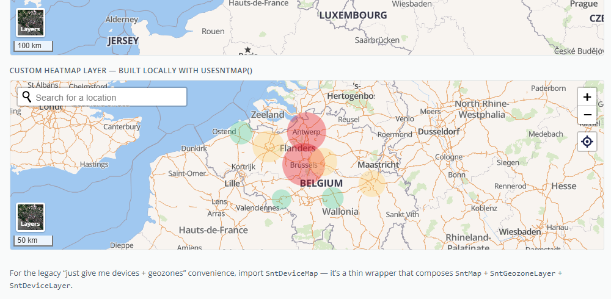

```jsx
function HeatLayer({ points }) {
  const { map, L } = useSntMap()
  const visible = useLayerToggle({ id: 'heatmap', label: 'Heatmap' })

  useEffect(() => {
    if (!map || !visible) return
    const group = L.featureGroup()
    for (const p of points) {
      L.circle([p.lat, p.lng], { radius: p.intensity * 20000, fillOpacity: 0.35 })
        .addTo(group)
    }
    group.addTo(map)
    return () => { map.removeLayer(group) }
  }, [map, L, points, visible])

  return null
}
```

**`SntDeviceMap`** is a thin convenience wrapper that composes `SntMap` +
`SntGeozoneLayer` + `SntDeviceLayer` — use it when you don't need custom
layers.

**`SntMarkerClusterLayer`** clusters heavy device lists — swap
`SntDeviceLayer` for it once you cross a few hundred markers.

---

## Design tokens

### CSS variables

Import the theme once (`@sensolus/snt-agent-kit/theme.css`) and use CSS
variables — **never hardcoded hex values**.

```css
/* Primary brand */
--snt-blue-darkest: #212851;   /* Headers, emphasis buttons */
--snt-blue:         #0071A1;   /* Links, focus states */

/* Greys */
--snt-grey:         #535E6F;   /* Secondary text */
--snt-grey-light:   #B8BFCA;   /* Borders */

/* Backgrounds */
--snt-bg-zebra:     #F9FAFA;   /* Alternating rows */
--snt-white:        #FFFFFF;

/* Status */
--snt-green:  #39CB99;         /* Success */
--snt-yellow: #FFCC66;         /* Warning */
--snt-red:    #E00000;         /* Danger */
--snt-ui-selected: #00A6ED;    /* Info */

/* Semantic aliases (preferred) */
--snt-color-primary:        var(--snt-blue-darkest);
--snt-color-success:        var(--snt-green);
--snt-color-warning:        var(--snt-yellow);
--snt-color-danger:         var(--snt-red);
--snt-color-text-primary:   var(--snt-blue-darkest);
--snt-color-text-secondary: var(--snt-grey);
--snt-color-border:         var(--snt-grey-light);
```

### `SntColors` / `SntBadgeColors`

JS constants matching the CSS variables — for JS-side styling (chart
palettes, dynamic inline styles).

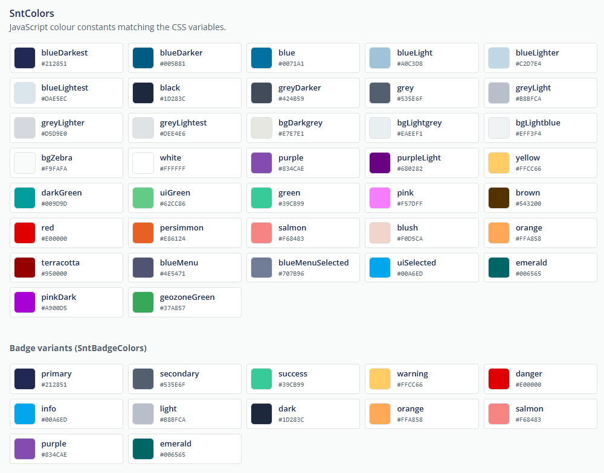

```jsx
import { SntColors, SntBadgeColors } from '@sensolus/snt-agent-kit'

<circle fill={SntColors.blue} />
<div style={{ background: SntBadgeColors.success }} />
```

`SNT_PALETTE_GROUPS` groups the constants by role for palette-picker UIs.

### `SNT_ICON_NAMES`

Enumerates every icon in the set — iterate for admin/settings pages that
need an icon picker.

```jsx
import { SNT_ICON_NAMES, SntIcon } from '@sensolus/snt-agent-kit'

SNT_ICON_NAMES.map(name => <SntIcon key={name} name={name} />)
```

---

## i18n framework

`LocaleProvider` fetches `/loginInfo` via `api.fetchLoginInfo` and exposes
formatters + a `t()` helper. App keys merge over kit keys via
`<LocaleProvider messages={...}>`.

**Supported languages:** en, nl, fr, de, es. English is the fallback for
missing keys.

### Translation keys

Flat object with dot-namespaced keys. Values are strings or functions
(interpolated).

```js
// src/i18n/translations/en.js
export default {
  'common.cancel': 'Cancel',
  'table.showing': (from, to, total) => `Showing ${from} - ${to} of ${total} items`,
}
```

```jsx
const { t } = useLocale()
t('common.cancel')                    // 'Cancel'
t('table.showing', 1, 25, 142)        // 'Showing 1 - 25 of 142 items'
```

### Formatters

Always pass `intlLocale` + `timezone` from `useLocale()`.

```jsx
import { formatShortDate, formatDateTime, formatNumber, useLocale } from '@sensolus/snt-agent-kit'

const { intlLocale, timezone } = useLocale()

formatShortDate('2026-03-23', intlLocale, timezone)   // "23 mrt. 2026" (nl)
formatDateTime('2026-03-23T14:07:00Z', intlLocale, timezone)
formatNumber(1234.5, intlLocale)                       // "1.234,5" (nl) / "1,234.5" (en)
```

---

## Regenerating screenshots

The images in `docs/screenshots/` are cropped from a full-page shot of the
widget showcase. To refresh them: run `npm run showcase` at the monorepo
root, open http://localhost:3100, capture the whole page (a browser
extension like FireShot works), and slice it per section.

---

## Extending safely

- **Don't fork widgets.** Every widget has a slot or render prop for
  customisation. Reach for `SntCard.titleButton`, `SntTable` column
  `render`, `SntDialog.footer`, `SntMap` children, etc. — or open a PR on
  this repo.
- **Don't deep-import.** `@sensolus/snt-agent-kit/dist/...` is blocked by
  ESLint in the scaffolded app. Import from the package root; `theme.css`
  is the only subpath allowed.
- **Don't re-declare `Snt*` components.** Also ESLint-enforced. If you
  need a variant that isn't there, propose it upstream.

Published built and minified, without sourcemaps — by design.
